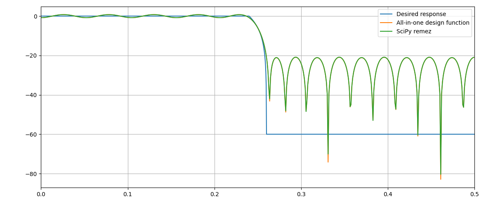
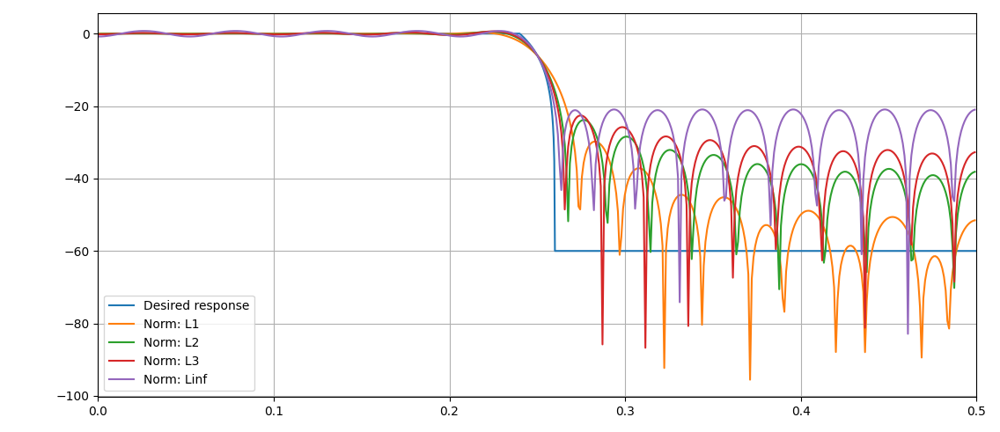

# All-in-one FIR filter design

Simple Python implementation of a FIR filter design function
supporting flexible desired frequency response configuration
and many optimization norms (thanks to CVXPY).

